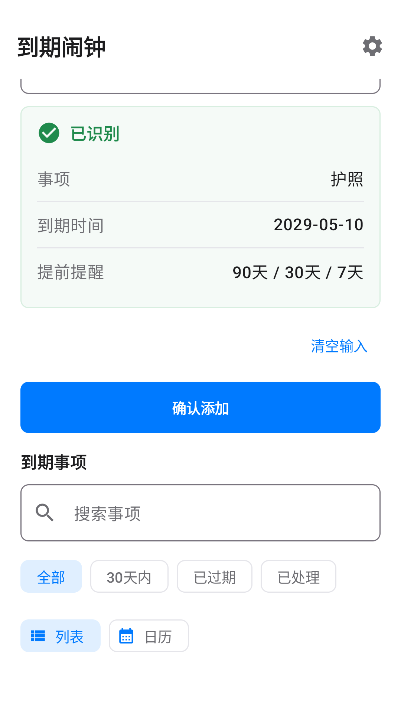
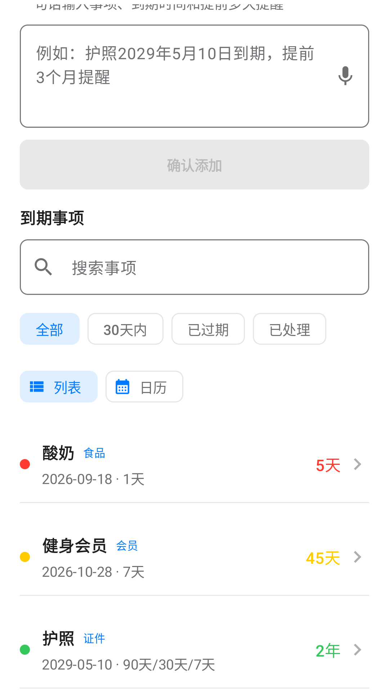
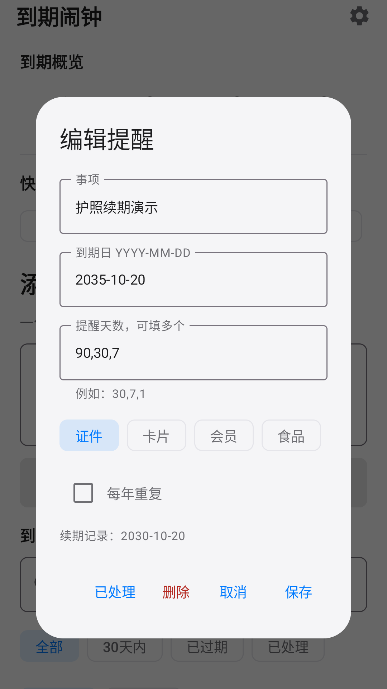

# 到期闹钟

一款本地优先的 Android 到期事项管理应用。用户可以用一句中文记录事项、到期日期和多个提前提醒时间，也可以通过设备端离线语音识别输入。

> 当前版本：`0.1.5`（`versionCode 6`）
>
> 包名：`com.daoqiji.app`
>
> Developer: Han Yongliang

## 主要功能

- 一句话解析事项、年月日和多个提醒点。
- 内置离线中文语音模型，语音和识别结果不上传开发者服务器。
- 支持证件、卡片、会员、食品和纪念日分类与快捷添加。
- 提供待处理、30 天内、已过期和已处理概览。
- 支持搜索、状态筛选、列表视图和按月日历视图。
- 支持每年重复、事项续期及历史到期日期。
- 支持 JSON 本地备份与恢复，无账号、广告、订阅或云同步。

## 应用截图

| 多时间提醒 | 分类列表 | 续期历史 |
| --- | --- | --- |
|  |  |  |

## 技术栈

- Kotlin + Jetpack Compose + Material 3
- Android Gradle Plugin 9.2.1 / Gradle 9.5.1
- Java 17
- `minSdk 26` / `targetSdk 35` / `compileSdk 36`
- sherpa-onnx 1.13.7 和离线中文 Zipformer CTC 模型

## 本地构建

准备 Android SDK 36 和 JDK 17，然后在项目根目录执行：

```bash
./gradlew assembleDebug
```

安装调试版到已连接设备：

```bash
./gradlew installDebug
```

运行本地单元测试：

```bash
./gradlew test
```

Debug 构建不需要签名文件。如需生成正式包，请参考 [`keystore/daoqiji-release.properties.example`](keystore/daoqiji-release.properties.example)，并在本地配置自己的签名证书。真实证书和密码文件已被 `.gitignore` 排除。

## 项目结构

```text
app/src/main/          应用源码、资源和离线语音模型
app/src/test/          日期解析、提醒、备份和语音结果测试
docs/                  设计与真机验证记录
release-materials/     应用商店文案、图标、截图和测试报告
```

## 数据与权限

- `RECORD_AUDIO`：仅在用户主动启动语音输入时使用。
- `POST_NOTIFICATIONS`：Android 13 及以上用于发送到期提醒。
- `RECEIVE_BOOT_COMPLETED`：设备重启后恢复已设置的提醒。

完整说明见[隐私政策](https://keke-han.github.io/expiry-alarm-privacy/)。

## 文档

- [版本记录](CHANGELOG.md)
- [第三方软件说明](THIRD_PARTY_NOTICES.md)
- [APK 测试说明](docs/APK_TESTING.md)
- [安全问题反馈](SECURITY.md)

## 版权

Copyright (c) 2026 Han Yongliang。保留所有权利。本仓库源代码公开展示，但未授予开源许可；未经书面许可不得复制、分发或用于派生作品。第三方组件仍适用其各自许可证。
